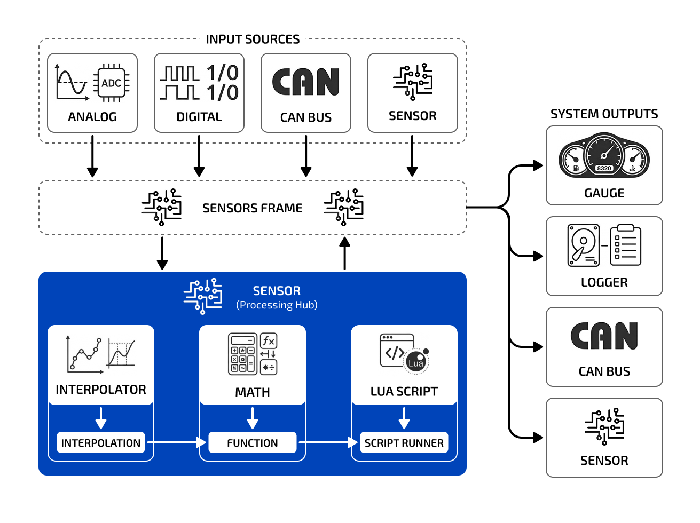

EerieLeap is an open-source data acquisition, processing, and monitoring system. It provides a robust platform for sensor data collection and management, supporting digital, analog, and CAN bus inputs.

## Features

Core features of the system include:

- Real-time sensor data collection and processing
- CAN bus data collection and streaming
- [CAN DBC](https://www.csselectronics.com/pages/can-dbc-file-database-intro) configuration import support
- Data logging in [ASAM MDF4](https://www.asam.net/standards/detail/mdf/) format
- Custom math expressions for sensor value calculation (including derived values from other sensors)
- [Lua](https://www.lua.org/) script processing for sensor values and CAN messages
- Modular, configurable sensor dashboard with flexible widget layout
- Multi-device network with many-to-many relationships
- Cross-platform companion app

## Data Flow Diagram

## Resources

Here's a quick summary of resources to help you find your way around:

* **Documentation**: [EerieLeap Real-Time Documentation](https://github.com/EerieLeap/rt_docs)
* **Wiki**: [EerieLeap Real-Time GitHub wiki](https://github.com/EerieLeap/rt_docs/wiki)
* **CAN Device Management Protocol**: [Documentation](https://github.com/EerieLeap/rt_core/blob/main/src/subsys/cdmp/README.md) for custom CAN bus network protocol built for the EerieLeap project

## Projects

* **rt_core**: [EerieLeap Real-Time Core](https://github.com/EerieLeap/rt_core) - core common module used by Zephyr RTOS projects
* **rt_daq**: [EerieLeap Real-Time DAQ](https://github.com/EerieLeap/rt_daq) - Zephyr RTOS project for data acquisition and processing device
* **rt_gauge**: [EerieLeap Real-Time Gauge](https://github.com/EerieLeap/rt_gauge) - Zephyr RTOS project for indication device gauge/dashboard